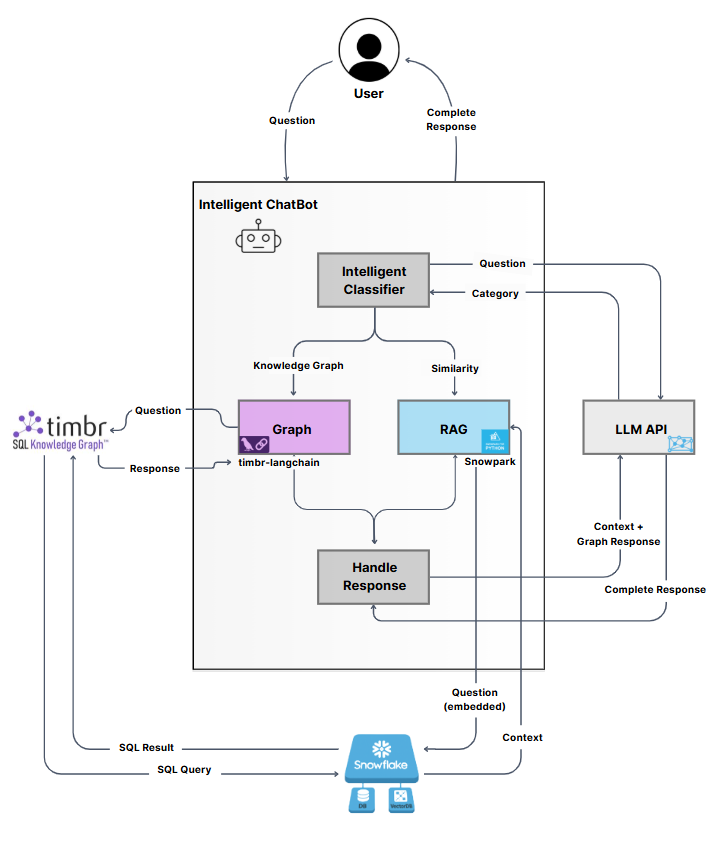
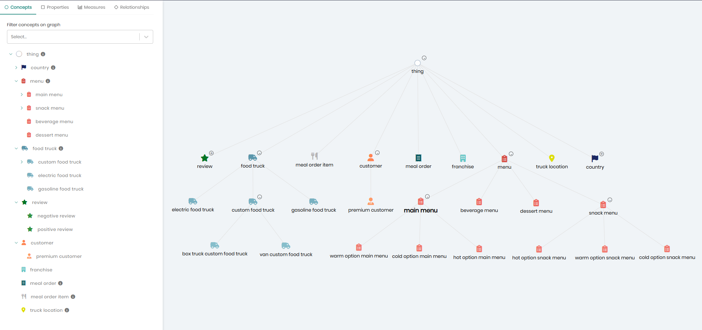
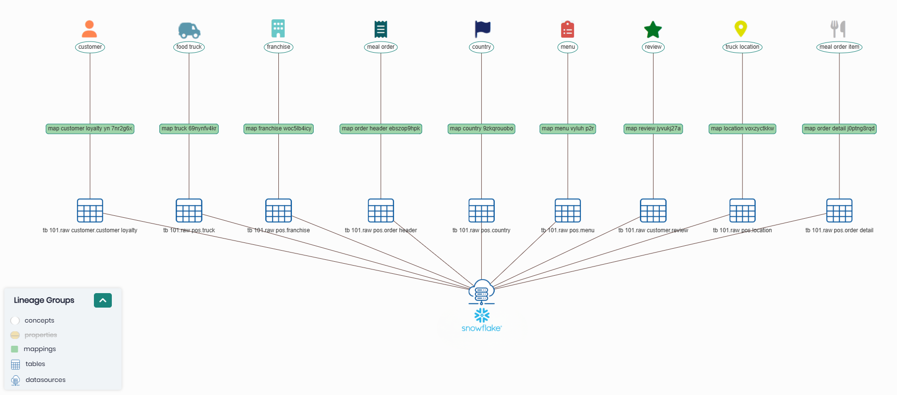
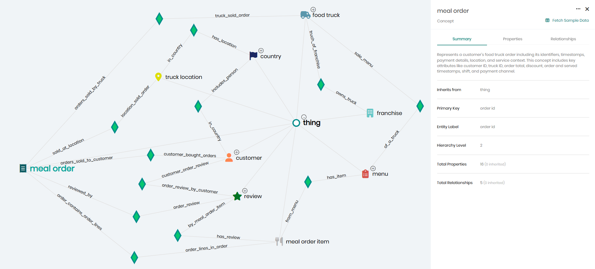
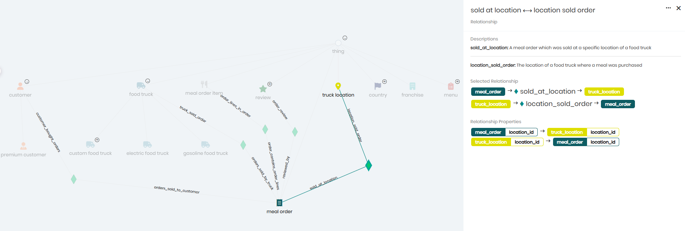

# Timbr GraphRAG Demo

A comprehensive demonstration of GraphRAG (Graph-Retrieval Augmented Generation) using Timbr and Snowflake, built on the Tasty Bytes dataset.

## Overview

This demo showcases how to build a powerful GraphRAG system that combines:
- **Structured data queries** through Timbr's knowledge graph
- **Unstructured data retrieval** via [Snowflake Cortex Search Service](https://docs.snowflake.com/en/user-guide/snowflake-cortex/cortex-search/cortex-search-overview)
- **Intelligent routing** using LLM-based question classification and routing.

---

For detailed information about the implementation, data, and setup scripts, see [`README.md`](./README.md).

---

### What is GraphRAG?

GraphRAG enhances traditional Retrieval-Augmented Generation (RAG) by combining graph-based structured data with vector-based unstructured data, providing more accurate and contextual responses to natural language queries. Unlike conventional RAG systems that rely solely on semantic similarity search through vector embeddings, GraphRAG leverages domain-specific knowledge graphs to understand relationships between entities and concepts. This dual approach enables the system to perform precise semantic searches on unstructured text while simultaneously querying structured data through graph traversals, resulting in richer context and more comprehensive answers that span both explicit data relationships and implicit semantic connections.

### About Tasty Bytes

Tasty Bytes is Snowflake's fictional food truck company dataset from Snowflake [official quickstart tutorial](https://quickstarts.snowflake.com/guide/tasty_bytes_introduction/index.html#0), featuring a global network of food trucks with comprehensive data including orders, customers, locations, menus, and reviews. For this GraphRAG demonstration, we've extended the original dataset with AI-generated meal reviews stored as PDFs to showcase the power of combining structured relational data with unstructured document content in a unified query system powered by the Snowflake and Timbr Virtual Knowledge Graph.


## Architecture

### Core Components

1. **Snowflake** - Cloud-native data platform with integrated ML services
2. **Snowflake Cortex** - Handles unstructured data processing and vector search
3. **Timbr** - Provides virtual ontology and graph query capabilities
4. **OpenAI API** - Powers question classification and response generation

### Data Flow

The application uses an intelligent routing system:
- **Graph queries**: Structured data questions → Timbr → SQL execution
- **Vector queries**: Semantic similarity questions → Cortex Search Service → relevant document chunks
- **Hybrid queries**: Combines both approaches for comprehensive answers

### Architecture Diagram

 
 
## Quick Start

### Prerequisites

- Python 3.11+
- Snowflake account with Cortex enabled
- Timbr account and API access
- OpenAI API key

### Installation

1. **Clone the repository**
   ```bash
   git clone <repository-url>
   cd GraphRAG/
   ```

2. **Prepare Virtual Environment**

   ```bash
   pip install virtualenv
   python -m venv env
   ```

   **Windows users:**
   ```bash
   env\Scripts\activate
   ```

   **MacOS / Linux users:**
   ```bash
   source env/bin/activate
   ```

3. **Install dependencies**
   ```bash
   pip install -r requirements.txt
   ```

   **Important:** You must install the **timbr-langchain** package manually. **Request from your Timbr account manager the `pip install` command for the timbr-langchain library.**

4. **Configure environment variables**
   Copy the [.env.example](./.env.example) file to a new `.env` file by running

   ```bash
   cp .env.example .env
   ```
   Then edit the `.env` file with your credentials.

## Setup Guide

### Step 1: Snowflake Environment Setup

Set up the Tasty Bytes database following the Snowflake quickstart tutorial:
- Enter your Worksheet in the Snowflake app
- Run the provided SQL script in [`./setup/Tasty Bytes - Introduction - Partial.sql`](./setup/Tasty%20Bytes%20-%20Introduction%20-%20Partial.sql) to create the tables
   - The script loads a partial subset of the large `order_detail` table to shorten the setup time.
- Run [`./setup/review_data_insert.sql`](./setup/review_data_insert.sql) to create the REVIEW table with AI-generated customer reviews:
   - The REVIEW table contains synthetic order reviews, including customer, order, and truck details from the Tasty Bytes dataset. Please note that there may be minor inconsistencies in the generated data, as it was created using an LLM.
      - 100 sample reviews with associated metadata
      - Links to existing orders and customers
      - Reviews were extracted from PDF documents and processed using an LLM.
- Create a dedicated read-only user in Snowflake for use with Timbr
   - Run the [`./setup/timbr_ro_user_on_snow.sql`](./setup/timbr_ro_user_on_snow.sql) to create the user and assign the role for read-only access
      - Be sure to modify the default values and set a secure user password

### Step 2: Configuring the Timbr Ontology

Create a knowledge graph ontology over Tasty Bytes:
   
1. **Build virtual ontology**:
   - Add a new **Snowflake** datasource
   - Create a new knowledge graph named `tasty_bytes` and assign the **Snowflake** datasource
   - Enter the **SQL Editor** page and after choosing the `tasty_bytes` knowledge graph, run the provided SQL script in [`./setup/timbr_ontology.sql`](./setup/timbr_ontology.sql) to create the ontology.
   - Enter the **Ontology Explorer** page to see the newly created ontology based on `tasty_bytes`

**The _Tasty Bytes_ Knowledge Graph**


**Data Lineage in the _Tasty Bytes_ Knowledge Graph**


**Relationships in the _Tasty Bytes_ Knowledge Graph**


**_Meal Order_ concept relationships in the _Tasty Bytes_ Knowledge Graph**



### Step 3: Embed Unstructured Data

Set up Snowflake Cortex Search Service for PDF processing:

1. Follow the [Cortex Search quickstart](https://quickstarts.snowflake.com/guide/ask_questions_to_your_own_documents_with_snowflake_cortex_search/#1)
2. Use the provided PDF files in the [`data/`](./data/) folder
3. Run [`./setup/create unstructured review pdfs.sql`](./setup/create%20unstructured%20review%20pdfs.sql) to load the unstructured PDFs into Snowflake Cortex

### Step 4: Launch the Application

```bash
streamlit run app.py
```

## Sample Queries

### Graph Queries (Structured Data)
- "What is the make and model of the electric food truck with the most orders in 2022 and how many orders it sold?"
- "List the meal orders with names of the premium customers who ordered the meals and the name of their preferred truck location"
- "What is the location, country and city with the most food trucks?"

### Vector Queries (Unstructured Data)
- "What's common about the least satisfactory dishes?"
- "List negative reviews about salads"
- "What is the most popular complaint?"

### Hybrid Queries
- "Which food truck gets the best reviews for chicken?" 
- "Show highly-rated items mentioned in positive reviews"

## Support

- 📧 [Email](mailto:support@timbr.ai)
- 📖 [Timbr Documentation](https://docs.timbr.ai)
- 📽️ [Tutorials and videos](https://www.youtube.com/playlist?list=PLGgEl0X3EtLkzCVbQmxyVR1l5PM9tG3Uw)
- 🌐 [Timbr Website](https://timbr.ai)
