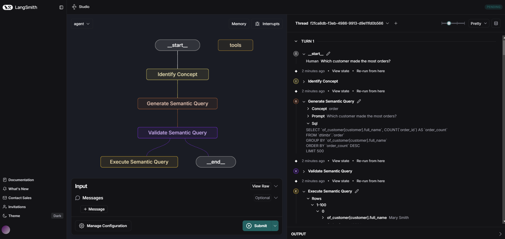

# LangGraph Interface

The LangGraph interface provides a modular and extensible way to build conversational workflows using the Timbr LangChain SDK. It leverages the power of LangChain's graph-based orchestration to connect multiple nodes—each representing a distinct step in the semantic query pipeline—such as concept identification, SQL generation, validation, execution, and response generation.

With LangGraph, you can:

- **Compose Custom Workflows:** Chain together different nodes to create tailored conversational agents that understand natural language, generate ontology-enriched SQL, and return context-aware answers.
- **Integrate Multiple LLMs:** Seamlessly switch between or combine various large language models (LLMs) like OpenAI GPT, Anthropic Claude, and Timbr's native LLM.
- **Maintain State:** Pass a state object through each node, allowing for complex, multi-turn interactions and context retention.
- **Extend Functionality:** Add your own custom nodes or modify existing ones to fit specific business logic or data sources.

This interface is ideal for developers looking to build advanced, ontology-driven natural language applications that require flexible orchestration and integration with enterprise knowledge graphs.

## Requirements

To use this SDK, ensure you have the following:

- **Python Version**: Python 3.9+
- **Required Dependencies**:

  ```bash
  langchain==0.3.25
  langchain_community==0.3.20
  langgraph==0.3.20
  pytimbr-api>=1.0.8
  pydantic==2.10.4
  ```

- **Optional Dependencies (Depending on LLM provider)**:

  ```bash
  langchain-anthropic==0.3.1
  anthropic==0.42.0
  langchain-openai==0.3.16
  openai==1.77.0
  ```

## Installation

### Using pip

```bash
python -m pip install langchain-timbr
```

## Install with selected LLM providers

### One of: openai, anthropic, google, azure_openai, snowflake, databricks, vertex_ai, bedrock (or 'all')

```bash
python -m pip install 'langchain-timbr[<your selected providers, separated by comma w/o space>]'
```

## Configuration

All chains, agents, and nodes support optional environment-based configuration. You can set the following environment variables to provide default values and have easy setup for the provided tools:

**Timbr Connection Variables:**

- **TIMBR_URL**: Default Timbr server URL
- **TIMBR_TOKEN**: Default Timbr authentication token  
- **TIMBR_ONTOLOGY** or **ONTOLOGY**: Default ontology/knowledge graph name

When these environment variables are set, the corresponding parameters (`url`, `token`, `ontology`) become optional in all chain and agent constructors and will use the environment values as defaults.

**LLM Configuration Variables:**

- **LLM_TYPE**: Type of LLM to use (e.g., "openai", "anthropic", "azure_openai", "google", "snowflake", "databricks", "chat-vertexai", "amazon_bedrock_converse_chat", "timbr")
- **LLM_API_KEY**: API key for the LLM provider
- **LLM_MODEL**: Model name to use (e.g., "gpt-4o", "claude-3-5-sonnet-20241022")
- **LLM_TEMPERATURE**: Temperature setting for the LLM (default: 0.1)
- **LLM_ADDITIONAL_PARAMS**: Additional parameters as JSON string (e.g., '{"max_tokens": 1000}')

When LLM environment variables are set, the `llm` parameter becomes optional and will use the `LlmWrapper` with environment configuration.

Example environment setup:

```bash
# Timbr connection
export TIMBR_URL="https://your-timbr-app.com/"
export TIMBR_TOKEN="tk_XXXXXXXXXXXXXXXXXXXXXXXX"
export TIMBR_ONTOLOGY="timbr_knowledge_graph"

# LLM configuration
export LLM_TYPE="openai-chat"
export LLM_API_KEY="your-openai-api-key"
export LLM_MODEL="gpt-4o"
export LLM_TEMPERATURE="0.1"
export LLM_ADDITIONAL_PARAMS='{"max_tokens": 1000}'
```

## Directory Structure and Key Files

This folder contains example code and utilities for building graph-based conversational workflows with the Timbr LangChain SDK. The main files are:

- `timbr_execute_semantic_sql_node.py`: Example node for executing semantic SQL queries in a LangGraph workflow.
- `timbr_generate_sql_node.py`: Node for generating Timbr SQL from natural language prompts.
- `timbr_graph_pipeline.py`: Example of composing a full LangGraph pipeline for NL-to-SQL-to-results.
- `timbr_identify_concept_node.py`: Node for identifying the relevant concept and schema from a user query.
- `timbr_validate_semantic_sql.py`: Node for validating and adjusting generated SQL queries.
- `timbr-langgraph.png`: Diagram illustrating the LangGraph workflow and node relationships.

You can use these files as templates to build your own custom graph-based agents and workflows.

## Features

- **Multi-LLM Support**: Integrates with OpenAI GPT, Anthropic Claude, Google Gemini, Databricks DBRX/llama, Snowflake Cortex, Google VertexAI, AWS Bedrock, and Timbr's native LLM (or any custom LLM using the LangChain interface)
- **SQL Generation**: Generate semantic SQL queries (ontology-enriched queries).
- **Knowledge Graph Access**: Interact with ontologies in natural language and retrieve context-aware answers.
- **Streamlined Querying**: Combine natural language inputs with Timbr using simple methods like `run_llm_query`.



### Identify Concept Node

Wraps the **IdentifyTimbrConceptChain** functionality to identify the relevant concept (and schema) based on the latest message in the state object.

**Parameters:**

| Parameter | Type / Default | Description |
|-----------|----------------|-------------|
| **llm** | LLM<br />Default: None<br />**Optional** | Language model instance (or a function taking a prompt string and returning an LLM's response). If None, uses `LlmWrapper` with environment variables. |
| **url** | str<br />Default: None<br />**Optional** | Timbr server URL. If None, uses the value from the `TIMBR_URL` environment variable. |
| **token** | str<br />Default: None<br />**Optional** | Timbr authentication token. If None, uses the value from the `TIMBR_TOKEN` environment variable. |
| **ontology** | str<br />Default: None<br />**Optional** | Name of the ontology/knowledge graph. If None, uses the value from the `TIMBR_ONTOLOGY` or `ONTOLOGY` environment variable. |
| **concepts_list** | List[str] or str<br />Default: None<br />**Optional** | Collection of concepts to include (List of strings, or a string of concept names divided by comma).<br />- If None, empty or '*', all available concepts are used.<br />- If populated, only those concepts will be included in query generation.<br />- If 'none' or 'null', no concepts will be used for the query. |
| **views_list** | List[str] or str<br />Default: None<br />**Optional** | Collection of views/cubes to include (List of strings, or a string of view/cube names divided by comma).<br />- If None, empty or '*', all available views/cubes are used.<br />- If populated, only those views/cubes will be included in query generation.<br />- If 'none' or 'null', no views/cubes will be used for the query. |
| **include_logic_concepts** | bool<br />Default: False<br />**Optional** | Whether to include logic concepts (concepts without unique properties which only inherit from an upper level concept with filter logic) in the query.<br />*Note: This parameter has no effect when `concepts_list` is provided.* |
| **include_tags** | List[str] or str<br />Default: None<br />**Optional** | Specific concept/property tag names to consider when generating the query.<br />- If `None` or empty, no tags are used.<br />- If a single string or list of strings is provided, only those tags (if they exist) will be attached to the prompt.<br />- Use List of strings or a comma-separated string (e.g. `'tag1,tag2'`) to specify multiple tags.<br />- Use `'*'` to include **all** tags. |
| **should_validate_sql** | bool<br />Default: True<br />**Optional** | Whether to validate the identified concept before returning it. |
| **retries** | int<br />Default: 2<br />**Optional** | Number of retry attempts if the identified concept is invalid. |
| **note** | str<br />Default: None<br />**Optional** | Additional note to extend the LLM prompt. |
| **verify_ssl** | bool<br />Default: True<br />**Optional** | Whether to verify SSL certificates. |
| **is_jwt** | bool<br />Default: False<br />**Optional** | Whether to use JWT authentication. |
| **jwt_tenant_id** | str<br />Default: None<br />**Optional** | Tenant ID for JWT authentication (if applicable). |
| **conn_params** | dict<br />Default: None<br />**Optional** | Extra Timbr connection parameters sent with every request (e.g., 'x-api-impersonate-user'). |

**Usage Example:**

```python
from langgraph.graph import StateGraph
from langchain_timbr import IdentifyConceptNode

llm_instance = <your_llm_instance>  # Replace with your actual LLM instance (optional)
identify_node = IdentifyConceptNode(
    llm=llm_instance,  # optional: uses LlmWrapper with env vars if not specified
    # url, token, ontology are optional if environment variables are set
    url="https://your-timbr-app.com/",  # optional: uses TIMBR_URL if not specified
    token="tk_XXXXXXXXXXXXXXXXXXXXXXXX",  # optional: uses TIMBR_TOKEN if not specified
    ontology="timbr_knowledge_graph",  # optional: uses TIMBR_ONTOLOGY/ONTOLOGY if not specified
    concepts_list=["Sales", "Orders"],
    views_list=["sales_view"]
)

state = StateGraph(dict)
state.messages = [{"content": "What are the total sales for last month?"}]

output = identify_node(state)
print("Identified Concept:", output)
```

### Generate SQL Node

Wraps the **GenerateTimbrSqlChain** functionality to generate SQL from a natural language prompt. Expects the state to include a `prompt` and returns a payload containing the generated SQL, schema, and concept.

**Parameters:**

| Parameter | Type / Default | Description |
|-----------|----------------|-------------|
| **llm** | LLM<br />Default: None<br />**Optional** | Language model instance (or a function taking a prompt string and returning an LLM's response). If None, uses `LlmWrapper` with environment variables. |
| **url** | str<br />Default: None<br />**Optional** | Timbr server URL. If None, uses the value from the `TIMBR_URL` environment variable. |
| **token** | str<br />Default: None<br />**Optional** | Timbr authentication token. If None, uses the value from the `TIMBR_TOKEN` environment variable. |
| **ontology** | str<br />Default: None<br />**Optional** | Name of the ontology/knowledge graph. If None, uses the value from the `TIMBR_ONTOLOGY` or `ONTOLOGY` environment variable. |
| **schema** | str<br />Default: None<br />**Optional** | Name of the schema to query. |
| **concept** | str<br />Default: None<br />**Optional** | Name of a specific concept to query. |
| **concepts_list** | List[str] or str<br />Default: None<br />**Optional** | Collection of concepts to include (List of strings, or a string of concept names divided by comma).<br />- If None, empty or '*', all available concepts are used.<br />- If populated, only those concepts will be included in query generation.<br />- If 'none' or 'null', no concepts will be used for the query. |
| **views_list** | List[str] or str<br />Default: None<br />**Optional** | Collection of views/cubes to include (List of strings, or a string of view/cube names divided by comma).<br />- If None, empty or '*', all available views/cubes are used.<br />- If populated, only those views/cubes will be included in query generation.<br />- If 'none' or 'null', no views/cubes will be used for the query. |
| **include_logic_concepts** | bool<br />Default: False<br />**Optional** | Whether to include logic concepts (concepts without unique properties which only inherit from an upper level concept with filter logic) in the query.<br />*Note: This parameter has no effect when `concepts_list` is provided.* |
| **include_tags** | List[str] or str<br />Default: None<br />**Optional** | Specific concept/property tag names to consider when generating the query.<br />- If `None` or empty, no tags are used.<br />- If a single string or list of strings is provided, only those tags (if they exist) will be attached to the prompt.<br />- Use List of strings or a comma-separated string (e.g. `'tag1,tag2'`) to specify multiple tags.<br />- Use `'*'` to include **all** tags. |
| **exclude_properties** | List[str] or str<br />Default: None<br />**Optional** | Collection of properties to exclude from the query (List of strings, or a string of property names divided by comma. entity_id, entity_type & entity_label are excluded by default). |
| **should_validate_sql** | bool<br />Default: True<br />**Optional** | Whether to validate the SQL before executing it. |
| **retries** | int<br />Default: 2<br />**Optional** | Number of retry attempts if the generated SQL is invalid. |
| **max_limit** | int<br />Default: 100<br />**Optional** | Maximum number of rows to return. |
| **note** | str<br />Default: None<br />**Optional** | Additional note to extend the LLM prompt. |
| **db_is_case_sensitive** | bool<br />Default: False<br />**Optional** | Whether the database is case sensitive. |
| **graph_depth** | int<br />Default: 1<br />**Optional** | Maximum number of relationship hops to traverse from the source concept during schema exploration. |
| **enable_reasoning** | bool<br />Default: False<br />**Optional** | Whether to enable reasoning during SQL generation. |
| **reasoning_steps** | int<br />Default: 2<br />**Optional** | Number of reasoning steps to perform if reasoning is enabled. |
| **verify_ssl** | bool<br />Default: True<br />**Optional** | Whether to verify SSL certificates. |
| **is_jwt** | bool<br />Default: False<br />**Optional** | Whether to use JWT authentication. |
| **jwt_tenant_id** | str<br />Default: None<br />**Optional** | Tenant ID for JWT authentication (if applicable). |
| **conn_params** | dict<br />Default: None<br />**Optional** | Extra Timbr connection parameters sent with every request (e.g., 'x-api-impersonate-user'). |

**Usage Example:**

```python
from langgraph.graph import StateGraph
from langchain_timbr import GenerateTimbrSqlNode

llm_instance = <your_llm_instance>  # Replace with your actual LLM instance (optional)
generate_sql_node = GenerateTimbrSqlNode(
    llm=llm_instance,  # optional: uses LlmWrapper with env vars if not specified
    # url, token, ontology are optional if environment variables are set
    url="https://your-timbr-app.com/",  # optional: uses TIMBR_URL if not specified
    token="tk_XXXXXXXXXXXXXXXXXXXXXXXX",  # optional: uses TIMBR_TOKEN if not specified
    ontology="timbr_knowledge_graph",  # optional: uses TIMBR_ONTOLOGY/ONTOLOGY if not specified
    schema="dtimbr",
    concept="Sales"
)

state = StateGraph(dict)
state.messages = [{"content": "What are the total sales for last month?"}]

output = generate_sql_node(state)
print("Generated SQL Node Output:", output)
```

### Validate Semantic SQL Node

Wraps the **ValidateTimbrSqlChain** functionality to validate (and optionally adjust) a generated SQL query. Expects the state to include a `sql` and/or `prompt`, and returns the validated SQL, its validity status, and any error.

**Parameters:**

| Parameter | Type / Default | Description |
|-----------|----------------|-------------|
| **llm** | LLM<br />Default: None<br />**Optional** | Language model instance (or a function taking a prompt string and returning an LLM's response). If None, uses `LlmWrapper` with environment variables. |
| **url** | str<br />Default: None<br />**Optional** | Timbr server URL. If None, uses the value from the `TIMBR_URL` environment variable. |
| **token** | str<br />Default: None<br />**Optional** | Timbr authentication token. If None, uses the value from the `TIMBR_TOKEN` environment variable. |
| **ontology** | str<br />Default: None<br />**Optional** | Name of the ontology/knowledge graph. If None, uses the value from the `TIMBR_ONTOLOGY` or `ONTOLOGY` environment variable. |
| **schema** | str<br />Default: None<br />**Optional** | Name of the schema to query. |
| **concept** | str<br />Default: None<br />**Optional** | Name of a specific concept to query. |
| **retries** | int<br />Default: 2<br />**Optional** | Number of retry attempts if the generated SQL is invalid. |
| **concepts_list** | List[str] or str<br />Default: None<br />**Optional** | Collection of concepts to include (List of strings, or a string of concept names divided by comma).<br />- If None, empty or '*', all available concepts are used.<br />- If populated, only those concepts will be included in query generation.<br />- If 'none' or 'null', no concepts will be used for the query. |
| **views_list** | List[str] or str<br />Default: None<br />**Optional** | Collection of views/cubes to include (List of strings, or a string of view/cube names divided by comma).<br />- If None, empty or '*', all available views/cubes are used.<br />- If populated, only those views/cubes will be included in query generation.<br />- If 'none' or 'null', no views/cubes will be used for the query. |
| **include_logic_concepts** | bool<br />Default: False<br />**Optional** | Whether to include logic concepts (concepts without unique properties which only inherit from an upper level concept with filter logic) in the query.<br />*Note: This parameter has no effect when `concepts_list` is provided.* |
| **include_tags** | List[str] or str<br />Default: None<br />**Optional** | Specific concept/property tag names to consider when generating the query.<br />- If `None` or empty, no tags are used.<br />- If a single string or list of strings is provided, only those tags (if they exist) will be attached to the prompt.<br />- Use List of strings or a comma-separated string (e.g. `'tag1,tag2'`) to specify multiple tags.<br />- Use `'*'` to include **all** tags. |
| **exclude_properties** | List[str] or str<br />Default: None<br />**Optional** | Collection of properties to exclude from the query (List of strings, or a string of property names divided by comma. entity_id, entity_type & entity_label are excluded by default). |
| **max_limit** | int<br />Default: 100<br />**Optional** | Maximum number of rows to return. |
| **note** | str<br />Default: None<br />**Optional** | Additional note to extend the LLM prompt. |
| **db_is_case_sensitive** | bool<br />Default: False<br />**Optional** | Whether the database is case sensitive. |
| **graph_depth** | int<br />Default: 1<br />**Optional** | Maximum number of relationship hops to traverse from the source concept during schema exploration. |
| **enable_reasoning** | bool<br />Default: False<br />**Optional** | Whether to enable reasoning during SQL generation. |
| **reasoning_steps** | int<br />Default: 2<br />**Optional** | Number of reasoning steps to perform if reasoning is enabled. |
| **verify_ssl** | bool<br />Default: True<br />**Optional** | Whether to verify SSL certificates. |
| **is_jwt** | bool<br />Default: False<br />**Optional** | Whether to use JWT authentication. |
| **jwt_tenant_id** | str<br />Default: None<br />**Optional** | Tenant ID for JWT authentication (if applicable). |
| **conn_params** | dict<br />Default: None<br />**Optional** | Extra Timbr connection parameters sent with every request (e.g., 'x-api-impersonate-user'). |

**Usage Example:**

```python
from langgraph.graph import StateGraph
from langchain_timbr import ValidateSemanticSqlNode

llm_instance = <your_llm_instance>  # Replace with your actual LLM instance (optional)
validate_sql_node = ValidateSemanticSqlNode(
    llm=llm_instance,  # optional: uses LlmWrapper with env vars if not specified
    # url, token, ontology are optional if environment variables are set
    url="https://your-timbr-app.com/",  # optional: uses TIMBR_URL if not specified
    token="tk_XXXXXXXXXXXXXXXXXXXXXXXX",  # optional: uses TIMBR_TOKEN if not specified
    ontology="timbr_knowledge_graph",  # optional: uses TIMBR_ONTOLOGY/ONTOLOGY if not specified
    schema="dtimbr",
    concept="Sales",
    retries=3
)

state = StateGraph(dict)
state.sql = "SELECT SUM(amount) FROM sales WHERE date > current_date - INTERVAL '1 month'"
state.prompt = "What are the total sales for last month?"

output = validate_sql_node(state)
print("Validated SQL Node Output:", output)
```

### Execute Semantic SQL Node

Wraps the **ExecuteTimbrQueryChain** functionality to execute the generated SQL query. Expects the state to include a `prompt` and returns the query result rows.

**Parameters:**

| Parameter | Type / Default | Description |
|-----------|----------------|-------------|
| **llm** | LLM<br />Default: None<br />**Optional** | Language model instance (or a function taking a prompt string and returning an LLM's response). If None, uses `LlmWrapper` with environment variables. |
| **url** | str<br />Default: None<br />**Optional** | Timbr server URL. If None, uses the value from the `TIMBR_URL` environment variable. |
| **token** | str<br />Default: None<br />**Optional** | Timbr authentication token. If None, uses the value from the `TIMBR_TOKEN` environment variable. |
| **ontology** | str<br />Default: None<br />**Optional** | Name of the ontology/knowledge graph. If None, uses the value from the `TIMBR_ONTOLOGY` or `ONTOLOGY` environment variable. |
| **schema** | str<br />Default: None<br />**Optional** | Name of the schema to query. |
| **concept** | str<br />Default: None<br />**Optional** | Name of a specific concept to query. |
| **concepts_list** | List[str] or str<br />Default: None<br />**Optional** | Collection of concepts to include (List of strings, or a string of concept names divided by comma).<br />- If None, empty or '*', all available concepts are used.<br />- If populated, only those concepts will be included in query generation.<br />- If 'none' or 'null', no concepts will be used for the query. |
| **views_list** | List[str] or str<br />Default: None<br />**Optional** | Collection of views/cubes to include (List of strings, or a string of view/cube names divided by comma).<br />- If None, empty or '*', all available views/cubes are used.<br />- If populated, only those views/cubes will be included in query generation.<br />- If 'none' or 'null', no views/cubes will be used for the query. |
| **include_logic_concepts** | bool<br />Default: False<br />**Optional** | Whether to include logic concepts (concepts without unique properties which only inherit from an upper level concept with filter logic) in the query.<br />*Note: This parameter has no effect when `concepts_list` is provided.* |
| **include_tags** | List[str] or str<br />Default: None<br />**Optional** | Specific concept/property tag names to consider when generating the query.<br />- If `None` or empty, no tags are used.<br />- If a single string or list of strings is provided, only those tags (if they exist) will be attached to the prompt.<br />- Use List of strings or a comma-separated string (e.g. `'tag1,tag2'`) to specify multiple tags.<br />- Use `'*'` to include **all** tags. |
| **exclude_properties** | List[str] or str<br />Default: None<br />**Optional** | Collection of properties to exclude from the query (List of strings, or a string of property names divided by comma. entity_id, entity_type & entity_label are excluded by default). |
| **should_validate_sql** | bool<br />Default: True<br />**Optional** | Whether to validate the SQL before executing it. |
| **retries** | int<br />Default: 2<br />**Optional** | Number of retry attempts if the generated SQL is invalid. |
| **max_limit** | int<br />Default: 100<br />**Optional** | Maximum number of rows to return. |
| **retry_if_no_results** | bool<br />Default: True<br />**Optional** | Whether to infer the result value from the SQL query. If the query won't return any rows, it will try to re-generate the SQL query then re-run it. |
| **no_results_max_retries** | int<br />Default: 2<br />**Optional** | Number of retry attempts to infer the result value from the SQL query. |
| **note** | str<br />Default: None<br />**Optional** | Additional note to extend the LLM prompt. |
| **db_is_case_sensitive** | bool<br />Default: False<br />**Optional** | Whether the database is case sensitive. |
| **graph_depth** | int<br />Default: 1<br />**Optional** | Maximum number of relationship hops to traverse from the source concept during schema exploration. |
| **enable_reasoning** | bool<br />Default: False<br />**Optional** | Whether to enable reasoning during SQL generation. |
| **reasoning_steps** | int<br />Default: 2<br />**Optional** | Number of reasoning steps to perform if reasoning is enabled. |
| **verify_ssl** | bool<br />Default: True<br />**Optional** | Whether to verify SSL certificates. |
| **is_jwt** | bool<br />Default: False<br />**Optional** | Whether to use JWT authentication. |
| **jwt_tenant_id** | str<br />Default: None<br />**Optional** | Tenant ID for JWT authentication (if applicable). |
| **conn_params** | dict<br />Default: None<br />**Optional** | Extra Timbr connection parameters sent with every request (e.g., 'x-api-impersonate-user'). |

**Usage Example:**

```python
from langgraph.graph import StateGraph
from langchain_timbr import ExecuteSemanticQueryNode

llm_instance = <your_llm_instance>  # Replace with your actual LLM instance (optional)
execute_query_node = ExecuteSemanticQueryNode(
    llm=llm_instance,  # optional: uses LlmWrapper with env vars if not specified
    # url, token, ontology are optional if environment variables are set
    url="https://your-timbr-app.com/",  # optional: uses TIMBR_URL if not specified
    token="tk_XXXXXXXXXXXXXXXXXXXXXXXX",  # optional: uses TIMBR_TOKEN if not specified
    ontology="timbr_knowledge_graph",  # optional: uses TIMBR_ONTOLOGY/ONTOLOGY if not specified
    schema="dtimbr",
    concept="Sales"
)

state = StateGraph(dict)
state.messages = [{"content": "What are the total sales for last month?"}]

output = execute_query_node(state)
print("Query Execution Rows:", output)
```

### Generate Response Node

Wraps the **GenerateAnswerChain** functionality to answer based on the prompt and query results.

**Parameters:**

| Parameter | Type / Default | Description |
|-----------|----------------|-------------|
| **llm** | LLM<br />Default: None<br />**Optional** | Language model instance (or a function taking a prompt string and returning an LLM's response). If None, uses `LlmWrapper` with environment variables. |
| **url** | str<br />Default: None<br />**Optional** | Timbr server URL. If None, uses the value from the `TIMBR_URL` environment variable. |
| **token** | str<br />Default: None<br />**Optional** | Timbr authentication token. If None, uses the value from the `TIMBR_TOKEN` environment variable. |
| **verify_ssl** | bool<br />Default: True<br />**Optional** | Whether to verify SSL certificates. |
| **is_jwt** | bool<br />Default: False<br />**Optional** | Whether to use JWT authentication. |
| **jwt_tenant_id** | str<br />Default: None<br />**Optional** | Tenant ID for JWT authentication (if applicable). |
| **conn_params** | dict<br />Default: None<br />**Optional** | Extra Timbr connection parameters sent with every request (e.g., 'x-api-impersonate-user'). |
| **note** | str<br />Default: None<br />**Optional** | Additional note to extend the LLM prompt. |

**Usage Example:**

```python
from langgraph.graph import StateGraph
from langchain_timbr import GenerateResponseNode

llm_instance = <your_llm_instance>  # Replace with your actual LLM instance (optional)
response_node = GenerateResponseNode(
    llm=llm_instance,  # optional: uses LlmWrapper with env vars if not specified
    # url, token are optional if environment variables are set
    url="https://your-timbr-app.com/",  # optional: uses TIMBR_URL if not specified
    token="tk_XXXXXXXXXXXXXXXXXXXXXXXX",  # optional: uses TIMBR_TOKEN if not specified
)

state = StateGraph(dict)
state.prompt = "Summarize last month total sales"
state.sql = "SELECT SUM(amount) FROM sales WHERE date > current_date - INTERVAL '1 month'"
state.schema = "dtimbr"
state.concept = "Sales"
state.rows = [{"total_sales": 1250000}]

output = response_node(state)
print("Generated Response:", output)
```

## Environment-Based Usage Examples

When environment variables are properly configured, you can simplify node creation:

```python
# With environment variables set (TIMBR_URL, TIMBR_TOKEN, TIMBR_ONTOLOGY)
# you can create nodes with minimal parameters

# Simplified node creation - uses timbr environment variables
llm_instance = <your_llm_instance>  # Optional - can be omitted if LLM env vars are set

identify_node = IdentifyConceptNode(llm=llm_instance)
generate_sql_node = GenerateTimbrSqlNode(llm=llm_instance)
validate_sql_node = ValidateSemanticSqlNode(llm=llm_instance)
execute_query_node = ExecuteSemanticQueryNode(llm=llm_instance)
response_node = GenerateResponseNode(llm=llm_instance)


# Simplified node creation - uses llm & timbr environment variables
identify_node = IdentifyConceptNode()
generate_sql_node = GenerateTimbrSqlNode()
validate_sql_node = ValidateSemanticSqlNode()
execute_query_node = ExecuteSemanticQueryNode()
response_node = GenerateResponseNode()
```

This approach is ideal for production environments where connection parameters are managed through environment configuration.

You can also use these powerful foundational building blocks like `GenerateTimbrSqlNode` and `ExecuteTimbrQueryNode` & more, for more granular control.

## Timbr Methods Overview

### `get_ontologies`

Fetch a list of available knowledge graphs in the Timbr environment.

```python
ontologies_list = llm_connector.get_ontologies()
```

### `set_ontology`

Set or switch the ontology for subsequent operations.

```python
llm_connector.set_ontology("<ontology_name>")
```

### `determine_concept`

Use the LLM to determine the appropriate concept and schema for a query.

```python
concept_name, schema_name = llm_connector.determine_concept("Show me sales by region.")
```

### `generate_sql`

Generate Timbr SQL for a user query.

```python
sql_query = llm_connector.generate_sql("What is the revenue by product category?", concept_name="sales_data")
```

### `validate_sql`

Validates Timbr SQL.

```python
is_sql_valid, error = llm_connector.validate_sql("What is the revenue by product category?", sql_query="SELECT SUM(revenue) FROM sales GROUP BY product_category")
```

### `run_timbr_query`

Run a Timbr SQL query and fetch results.

```python
results = llm_connector.run_timbr_query("SELECT * FROM sales_data")
```

### `run_llm_query`

Combine SQL generation and execution in a single step.

```python
response = llm_connector.run_llm_query("What are the top 5 products by sales?")
```

## Support

- 📧 [Email](mailto:support@timbr.ai)
- 📖 [Timbr Documentation](https://docs.timbr.ai)
- 📽️ [Tutorials and videos](https://www.youtube.com/playlist?list=PLGgEl0X3EtLkzCVbQmxyVR1l5PM9tG3Uw)
- 🌐 [Timbr Website](https://timbr.ai)
